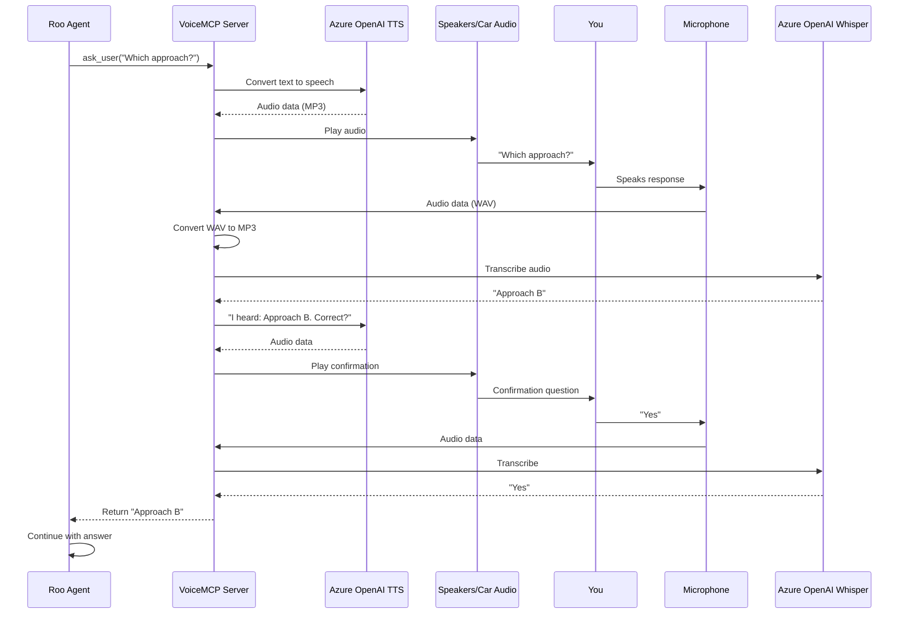

I spend a lot of time driving. During those drives, I often open ChatGPT on my phone (hands-free) to brainstorm architecture decisions or research technical approaches for problems I'm working on. Meanwhile, my Roo agent is back on [DevBox](https://devbox.microsoft.com/), grinding through the actual implementation work.

> **What is DevBox?**
> [Microsoft DevBox](https://devbox.microsoft.com/) is a cloud-based development environment that gives you powerful dev machines in the cloud. I find it incredibly useful because:
> - Work continues even when I close my laptop—agents keep running in the background
> - I can spin up multiple machines for different projects or experiments
> - No more "works on my machine" problems—everyone on the team gets the same environment
> - I can access my full dev setup from anywhere, even my phone (though I mostly just use it to let agents work while I'm mobile)

The problem? When Roo hits a decision point and needs my input, it just... stops. By the time I get home 40 minutes later, I've lost all that potential progress. The agent was ready to work, I was available to answer questions, but we had no way to communicate.

I'd already given my AI agent [eyes with Playwright MCP](/2025/11/17/give-your-ai-coding-agent-eyes-with-playwright-mcp.html). Why not give it a mouth and ears too?

## The Problem: AI Agents Can't Talk to You

AI coding agents are incredible at autonomous work, but they have a fundamental limitation—they can only communicate through text in their UI. This creates several pain points:

- **They get stuck waiting** - When they need clarification or approval, work stops
- **Lost context** - By the time you return, you've forgotten what you asked them to do
- **Wasted commute time** - That 30-minute drive could be productive collaboration time
- **Can't multitask** - You need to be at your desk, eyes on the screen

The agents work asynchronously, but communication doesn't. I wanted bidirectional voice communication—my agent could ask me questions through my car speakers, and I could respond hands-free while keeping my eyes on the road.

## The Solution: VoiceMCP

VoiceMCP is a Model Context Protocol server that gives AI agents the ability to communicate via voice. It's built on:

- **.NET 10** with Semantic Kernel for AI orchestration
- **Azure OpenAI** for both Text-to-Speech (TTS) and Speech-to-Text (Whisper)
- **NAudio** for audio recording and playback
- **MCP Protocol** to expose voice tools to any MCP-compatible client

The server exposes two main tools:
- `ask_user` - Ask a question and get a voice response
- `ask_for_approval` - Present a work summary and get approval/rejection


*Roo calling the ask_user tool to get voice input from the developer*

## How It Works: Architecture

Here's how the interaction flows:



The interaction flow:

1. **Agent asks a question** - Roo calls the `ask_user` MCP tool
2. **TTS speaks it** - Azure OpenAI converts text to natural speech
3. **You hear it** - Through your speakers or car audio via Bluetooth
4. **You respond** - Your microphone picks up your voice
5. **Whisper transcribes** - Azure OpenAI converts speech back to text
6. **Confirmation loop** - The agent reads back what it heard and asks for confirmation
7. **Agent continues** - With your verified answer, work proceeds

## The Code: Building Voice Communication

Let's walk through the key implementation details.

### Setting Up the MCP Server

The [`Program.cs`](https://github.com/tamirdresher/mcp-voice-assist/blob/main/VoiceMCP/Program.cs) file bootstraps the MCP server with Semantic Kernel:

```csharp
var builder = Host.CreateApplicationBuilder(args);

// Configure logging to stderr (stdout is for MCP protocol)
builder.Logging.AddConsole(o => o.LogToStandardErrorThreshold = LogLevel.Trace);

// Register MCP server with stdio transport
builder.Services
    .AddMcpServer()
    .WithStdioServerTransport()
    .WithToolsFromAssembly();

// Register voice service
builder.Services.AddSingleton<IVoiceService, SemanticKernelVoiceService>();

// Hybrid credential loading: Env vars (for MCP clients) → User secrets (dev)
var azureEndpoint = Environment.GetEnvironmentVariable("AZURE_OPENAI_ENDPOINT");
var azureApiKey = Environment.GetEnvironmentVariable("AZURE_OPENAI_API_KEY");
// ... fallback to user secrets if env vars not found ...

// Add Semantic Kernel with Azure OpenAI services
builder.Services.AddKernel()
    .AddAzureOpenAITextToAudio(
         deploymentName: azureTtsDeployment,
         endpoint: azureEndpoint,
         apiKey: azureApiKey)
    .AddAzureOpenAIAudioToText(
        deploymentName: azureWhisperDeployment,
        endpoint: azureEndpoint,
        apiKey: azureApiKey);

await builder.Build().RunAsync();
```

**Key points:**
- Logs go to `stderr` because `stdout` is reserved for MCP protocol messages
- Hybrid configuration supports both environment variables (for MCP clients) and user secrets (for development)
- Semantic Kernel handles the Azure OpenAI integration cleanly

### The AskUser Tool with Confirmation Loop

The [`VoiceTools.cs`](https://github.com/tamirdresher/mcp-voice-assist/blob/main/VoiceMCP/VoiceTools.cs) file implements the voice interaction tools. Here's the `ask_user` tool with its built-in confirmation loop:

```csharp
[McpServerTool, Description("Ask the user a question via voice and get a confirmed text response")]
public async Task<string> AskUser(string question)
{
    const int MAX_RETRIES = 4;
    int retryCount = 0;

    // 1. Speak the question
    await _voiceService.SpeakAsync(question);

    while (retryCount < MAX_RETRIES)
    {
        // 2. Listen for response
        string recognizedText = await _voiceService.ListenAsync();

        if (string.IsNullOrWhiteSpace(recognizedText))
        {
            retryCount++;
            if (retryCount >= MAX_RETRIES)
            {
                await _voiceService.SpeakAsync(
                    "I'm sorry, I couldn't understand your response after multiple attempts.");
                return "ERROR: Could not understand response after 4 attempts";
            }

            int attemptsRemaining = MAX_RETRIES - retryCount;
            await _voiceService.SpeakAsync(
                $"I didn't catch that. Please try again. {attemptsRemaining} attempt{(attemptsRemaining > 1 ? "s" : "")} remaining.");
            continue;
        }

        // 3. Confirmation Loop - Read back what we heard
        await _voiceService.SpeakAsync(
            $"I heard: {recognizedText}. Is this correct? Say yes or no.");
        string confirmation = await _voiceService.ListenAsync();

        if (IsAffirmative(confirmation))
        {
            return recognizedText;
        }
        else
        {
            await _voiceService.SpeakAsync("Okay, let's try again. What was your answer?");
            // Loop continues to ask the question again
        }
    }

    return "ERROR: Could not understand response after 4 attempts";
}

private bool IsAffirmative(string text)
{
    if (string.IsNullOrWhiteSpace(text)) return false;
    text = text.ToLowerInvariant().Trim();
    
    return text.Contains("yes") ||
           text.Contains("correct") ||
           text.Contains("yeah") ||
           text.Contains("yep") ||
           text.Contains("sure") ||
           text.Contains("right") ||
           text == "y";
}
```

**Why the confirmation loop matters:**

Voice recognition isn't perfect, especially in noisy environments like a car. The confirmation loop ensures:
- **Accuracy** - You verify what the AI heard before it acts on it
- **Trust** - You know exactly what response the agent will use
- **Error recovery** - Natural retry mechanism without frustration


*The complete confirmation flow: question asked, voice response transcribed, confirmation requested, and verified answer returned*

### Audio Processing: Recording and Transcription

The [`SemanticKernelVoiceService.cs`](https://github.com/tamirdresher/mcp-voice-assist/blob/main/VoiceMCP/SemanticKernelVoiceService.cs) handles the complex audio processing:

```csharp
public async Task<string> ListenAsync()
{
    // Record audio from microphone
    var audioData = await RecordAudioAsync();
    
    if (audioData == null || audioData.Length == 0)
    {
        Console.Error.WriteLine("No audio data recorded");
        return string.Empty;
    }

    // Convert WAV to MP3 for better Whisper compatibility
    var mp3Data = ConvertWavToMp3(audioData);
    
    // Send to Azure OpenAI Whisper
    var audioContent = new AudioContent(mp3Data, mimeType: "audio/mp3");
    var executionSettings = new OpenAIAudioToTextExecutionSettings
    {
        Language = "en",
        Filename = "audio.mp3",
        Temperature = 0.0f // Most accurate transcription
    };
    
    var textContent = await _audioToTextService.GetTextContentAsync(
        audioContent, executionSettings);
    
    return textContent?.Text ?? string.Empty;
}
```

**Audio recording with silence detection:**

```csharp
private async Task<byte[]> RecordAudioAsync()
{
    var silenceThreshold = 300;
    var silenceDuration = TimeSpan.FromSeconds(2.5);
    var hasSpoken = false;
    var silenceStart = DateTime.MaxValue;

    using var waveIn = new WaveInEvent
    {
        WaveFormat = new WaveFormat(16000, 1) // 16kHz, mono for Whisper
    };

    waveIn.DataAvailable += (sender, e) =>
    {
        recordedBytes.AddRange(e.Buffer.Take(e.BytesRecorded));

        var level = CalculateAudioLevel(e.Buffer, e.BytesRecorded);

        if (level > silenceThreshold)
        {
            hasSpoken = true;
            silenceStart = DateTime.MaxValue;
        }
        else if (hasSpoken && silenceStart == DateTime.MaxValue)
        {
            silenceStart = DateTime.Now;
        }
        else if (hasSpoken && (DateTime.Now - silenceStart) >= silenceDuration)
        {
            waveIn.StopRecording(); // Auto-stop after 2.5s of silence
        }
    };

    waveIn.StartRecording();
    // ... rest of recording logic ...
}
```

**The silence detection algorithm:**
1. Records at 16kHz mono (optimal for Whisper)
2. Continuously calculates audio levels
3. Detects when you start speaking (level > threshold)
4. Waits for 2.5 seconds of silence after you stop
5. Auto-stops recording to send to Whisper

This creates a natural conversation flow—you don't need to press any buttons, just speak and pause.

### Text-to-Speech: Making the AI Speak

```csharp
public async Task SpeakAsync(string text)
{
    var executionSettings = new OpenAITextToAudioExecutionSettings
    {
        Voice = "alloy", // Natural-sounding voice
        ResponseFormat = "mp3"
    };
    
    var audioContent = await _textToAudioService.GetAudioContentAsync(
        text, executionSettings);

    // Play the audio through speakers
    await PlayAudioAsync(audioContent.Data.Value.ToArray());
}

private async Task PlayAudioAsync(byte[] audioData)
{
    using var memoryStream = new MemoryStream(audioData);
    using var reader = new Mp3FileReader(memoryStream);
    using var waveOut = new WaveOutEvent();

    var tcs = new TaskCompletionSource<bool>();
    
    waveOut.PlaybackStopped += (sender, e) => tcs.TrySetResult(true);
    waveOut.Init(reader);
    waveOut.Play();

    await tcs.Task; // Wait for playback to complete
}
```

The Azure OpenAI TTS "alloy" voice sounds remarkably natural—far better than the robotic voices of the past.

## Configuration in Roo

Here's how I configured VoiceMCP in my Roo setup (with sensitive info sanitized):

**File:** `.roo/mcp.json`

```json
{
  "mcpServers": {
    "voice-mcp": {
      "command": "dotnet",
      "args": [
        "run",
        "--no-build",
        "--project",
        "C:/Users/[username]/source/repos/mcp-voice-assist/VoiceMCP/VoiceMCP.csproj"
      ],
      "env": {
        "AZURE_OPENAI_ENDPOINT": "https://[your-resource].openai.azure.com/",
        "AZURE_OPENAI_API_KEY": "[your-api-key]",
        "AZURE_OPENAI_TTS_DEPLOYMENT": "tts",
        "AZURE_OPENAI_WHISPER_DEPLOYMENT": "whisper"
      },
      "alwaysAllow": ["ask_user", "ask_for_approval"],
      "timeout": 3600
    }
  }
}
```

**Configuration highlights:**

- **`alwaysAllow`** - Roo won't ask permission each time to use voice tools (crucial for hands-free operation)
- **`timeout: 3600`** - Extended to 1 hour because voice interactions take longer than text
- **Environment variables** - Azure OpenAI credentials passed securely
- **`--no-build`** - Assumes you've pre-built the project for faster startup


*VoiceMCP configured in Roo's MCP settings with alwaysAllow permissions and extended timeout*

## Why This Matters: The Future of AI Collaboration

Giving AI agents a voice fundamentally changes how we collaborate with them:

### From Synchronous to Asynchronous

Before VoiceMCP, you needed to be at your desk, ready to respond to prompts. Now your AI can reach you anywhere—in the car, on a walk, even while cooking dinner.

### From Text-Only to Multimodal

I previously wrote about [giving AI agents eyes with Playwright MCP](/2025/11/17/give-your-ai-coding-agent-eyes-with-playwright-mcp.html). Now they have:
- **Eyes** - Can see and interact with web applications
- **Voice** - Can speak to you and hear your responses
- **Hands** - Can write code and execute commands

We're building genuinely multimodal AI agents.

### From Desktop-Bound to Mobile

The biggest win? Liberation from the desk. Your most productive coding sessions might happen during your commute, not at your workstation.

## Technical Considerations

### Audio Quality and Noise

Voice recognition works surprisingly well in cars with:
- **Bluetooth audio** - Routes TTS through car speakers with good clarity
- **Phone mic** - Modern phones have excellent noise cancellation
- **Confirmation loops** - Catch any misrecognitions before they cause problems

I've found it works reliably even with:
- Highway noise at 70 mph
- Radio playing softly in background
- Windows cracked for air

### Privacy and Security

Important considerations:
- **Audio is ephemeral** - Not stored, only sent to Whisper for transcription
- **Transcripts in logs** - Text responses appear in Roo's conversation history
- **API keys** - Stored in environment variables, never in code
- **Local processing** - Audio recorded locally, only MP3 sent to cloud

### Cost

Azure OpenAI pricing (as of Nov 2025):
- **TTS (Text-to-Speech)** - ~$15 per million characters
- **Whisper (Speech-to-Text)** - ~$0.006 per minute

For typical usage (10-20 voice interactions per day), expect ~$5-10/month.

## Getting Started

Want to try it yourself? The full source code is on GitHub: [tamirdresher/mcp-voice-assist](https://github.com/tamirdresher/mcp-voice-assist)

### Quick Setup

1. **Clone the repo:**
   ```bash
   git clone https://github.com/tamirdresher/mcp-voice-assist.git
   cd mcp-voice-assist
   ```

2. **Build the project:**
   ```bash
   dotnet build VoiceMCP.sln --configuration Release
   ```

3. **Configure Azure OpenAI:**
   ```bash
   # Set environment variables
   $env:AZURE_OPENAI_ENDPOINT = "https://your-resource.openai.azure.com/"
   $env:AZURE_OPENAI_API_KEY = "your-api-key"
   $env:AZURE_OPENAI_TTS_DEPLOYMENT = "tts-1"
   $env:AZURE_OPENAI_WHISPER_DEPLOYMENT = "whisper-1"
   ```

4. **Add to Roo config** (`.roo/mcp.json` as shown above)

5. **Restart Roo** - The voice tools will be available

### Prerequisites

- .NET 10 SDK
- Azure OpenAI account with TTS and Whisper deployments
- Windows OS (for NAudio)
- Microphone and speakers

## Conclusion

Voice-enabled AI agents aren't science fiction—they're practical tools that solve real problems. By giving your AI agent a voice, you:

- **Unlock asynchronous collaboration** - Work continues while you're away
- **Maximize productivity** - Turn commute time into development time  
- **Reduce context switching** - No need to constantly check on your agent
- **Enable hands-free workflows** - Safer and more convenient

Combined with visual capabilities from [Playwright MCP](/2025/11/17/give-your-ai-coding-agent-eyes-with-playwright-mcp.html), we're moving toward truly multimodal AI pair programming. Your agent can see your application, hear your voice, and speak back to you—creating a collaboration experience that feels remarkably natural.

The code is open source, the setup takes about 30 minutes, and the productivity gains are immediate. If you're already using AI coding agents, adding voice communication is the next logical step.

Now if you'll excuse me, I need to drive home and check on what my agent has been building.

---

*Using VoiceMCP or building something similar? I'd love to hear about your experience in the comments!*

## Related Posts

- [Give Your AI Coding Agent Eyes: Integrating Playwright MCP for Visual Testing](/2025/11/17/give-your-ai-coding-agent-eyes-with-playwright-mcp.html)
- [Scaling Your AI Development Team with Git Worktrees](/2025/10/20/scaling-your-ai-development-team-with-git-worktrees.html)