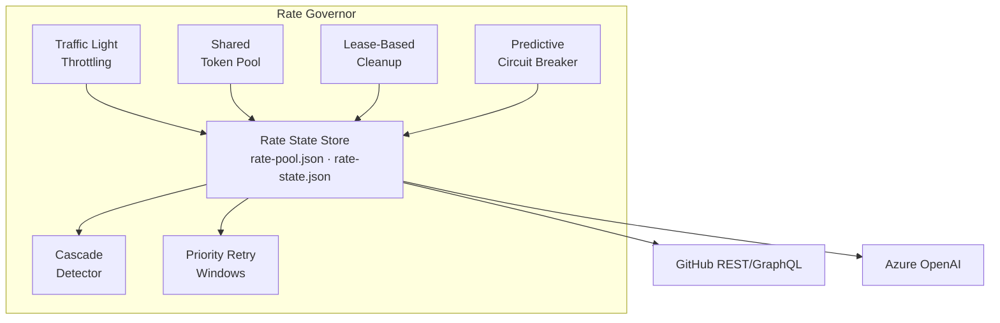
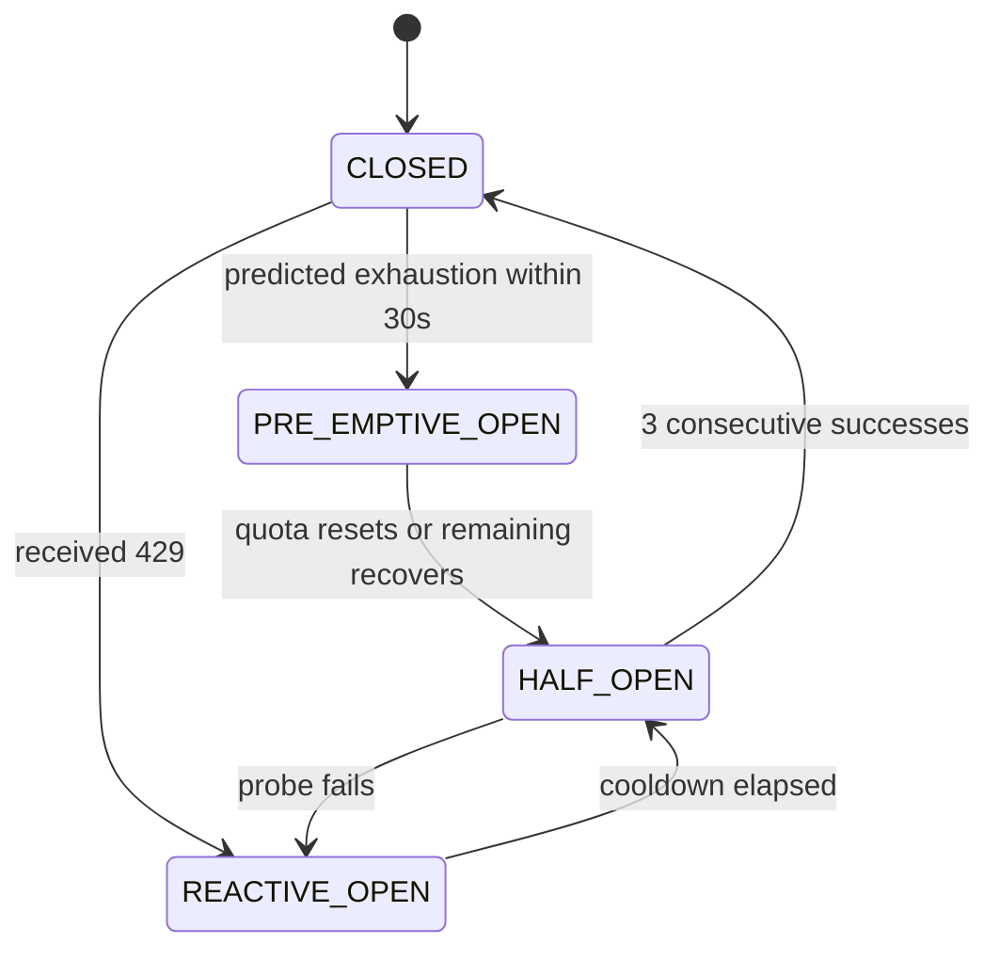

## The Story

I've been running [Squad](https://github.com/tamirdresher/squad) — a multi-agent AI framework — for a couple of weeks now. It orchestrates a team of AI agents that handle code review, architecture decisions, infrastructure, docs, and more. A reconciliation loop runs every 5 minutes, picking up work and dispatching agents. Most of the time it works great.

As I started planning to run Squad at scale — thinking about platforms like AKS, Azure VMs, or similar — I realized rate limiting with multiple agents is fundamentally different from single-service rate limiting. I found [this thread on r/GithubCopilot](https://www.reddit.com/r/GithubCopilot/s/N5DH2B8YA0) where other people were describing the exact same problem I was hitting. So I went and did some research and reading, stress-tested the system, and designed 6 patterns to handle it.

Here's what triggered the deep dive. As I added more machines and Ralph processes, things started breaking.

Nine agents launched simultaneously. In 22 minutes they opened **10 pull requests**. Impressive — until minute 8, when GitHub started returning `429 Too Many Requests`.

Every agent retried at the same time. The retry wave triggered a *second* 429 wave. That triggered a third. Within 90 seconds I'd burned through GitHub's 5,000 requests/hour limit and was locked out entirely. Meanwhile, Picard — my lead agent making critical architecture decisions — was stuck behind Ralph, a background polling agent that had eaten the remaining Copilot completions doing low-priority issue triage.

Even in just a couple of weeks of running the system, I'd already hit memory issues, resource contention, and agent crashes. But rate limiting with multiple agents sharing the same quotas? That was a different problem entirely — and one that gets worse the more I scale.

The core lesson:

> **Rate limiting in multi-agent systems is a coordination problem, not a retry problem.**

Every tool I evaluated — Azure API Management, Resilience4j, LangGraph — treats rate limiting as something each caller handles independently. But when 9 agents share the same API quotas, independent retry logic doesn't just fail. It actively makes things worse.

---

## The Three Failure Modes

Before designing anything, I had to understand *why* standard retry logic breaks down. I identified three patterns from my logs as the system scaled:

### 1. Thundering Herd

After a 429, all agents wait the same `Retry-After` duration and retry simultaneously. They collide again, triggering another 429. In my logs, `ralph-self-heal.log` showed **60+ chained failures** in a single incident. Classic distributed systems problem — except the "services" are AI agents that don't know about each other.

### 2. Priority Inversion

Ralph's background polling (checking for new GitHub issues every 5 minutes) consumed API quota that Picard needed for blocking architecture decisions. Both agents had equal retry priority. There was no way to say "Picard goes first" — so critical work waited behind background noise.

### 3. Cascade Amplification

A single GitHub secondary-rate-limit hit caused multiple agents to queue their pending work. When the limit lifted, they all flushed their queues at once — immediately re-triggering the limit. One 429 became a system-wide outage that took up to 60 minutes to recover from.

---

## 6 Patterns I Designed

Based on the research and what I observed, I designed a **Rate Governor** — a coordination layer that all agents consult before making API calls. Here are the six patterns inside it, each one a direct response to a failure mode I observed or anticipated as the system scales.




---

### Pattern 1: Traffic Light Throttling

**What broke:** Agents only reacted *after* hitting a 429. By then, the entire quota window was gone. Recovery meant waiting up to 60 seconds while every agent sat idle.

**What I learned:** When making direct API calls (e.g., via `gh api` or REST clients), every response includes `x-ratelimit-remaining` and `x-ratelimit-reset` headers. Nobody was reading them. (Note: these headers aren't directly exposed when using Copilot CLI with `-p` — this pattern applies when you're consuming APIs directly.)

I added a traffic-light system that reads remaining quota after every API call and adjusts behavior *before* hitting the wall:

| Zone | When | What happens |
|------|------|--------------|
| 🟢 Green | >40% quota left | Normal operation |
| 🟡 Amber | 15–40% left | Add proportional delays — background agents slow down first |
| 🔴 Red | <15% left | Background agents park. Standard agents slow to 1 req/sec. Critical agents pass through. |

Here's what the header parsing looks like for the GitHub REST API (which returns standard `x-ratelimit-*` headers):

```powershell
# Read rate-limit state from API response headers
$remaining = [int]$response.Headers["x-ratelimit-remaining"]
$limit     = [int]$response.Headers["x-ratelimit-limit"]
$resetAt   = $response.Headers["x-ratelimit-reset"]

$ratio = $remaining / $limit

if ($ratio -ge 0.40) {
    # GREEN — no throttling
} elseif ($ratio -ge 0.15) {
    # AMBER — proportional delay for non-critical agents
    $delayMs = 2000 * (0.40 - $ratio) / 0.25
    Start-Sleep -Milliseconds $delayMs
} else {
    # RED — park background agents, slow standard agents
    if ($Priority -eq 2) { return "PARKED" }
    if ($Priority -eq 1) { Start-Sleep -Seconds 1 }
    # P0 passes through immediately
}
```

> **Key insight:** Don't wait for a 429 to tell you you're out of quota. The headers tell you 10 calls in advance. Read them.

---

### Pattern 2: Shared Token Pool

**What broke:** All agents share API quotas (80 completions/hour on Copilot, 5,000 requests/hour on GitHub REST) but tracked consumption independently. When Ralph was idle, Picard couldn't borrow his unused allocation. When Ralph was busy triaging, he starved Data's code generation.

**What I learned:** Agents need a shared ledger. I created `rate-pool.json` — a single file (with file-locking) that tracks the shared quota, per-agent soft reservations, and a donation register where idle agents release unused capacity.

```jsonc
// rate-pool.json
{
  "github": {
    "window_completions_total": 80,
    "window_completions_remaining": 48,
    "agent_allocations": {
      "picard": { "reserved": 20, "used": 8 },
      "ralph":  { "reserved": 12, "used": 2 },
      "data":   { "reserved": 20, "used": 18 }
    },
    "donation_pool": 10
  }
}
```

The rules are simple:
- **P0 agents** (Picard, Worf) always get completions if any remain
- **P1 agents** (Data, Seven) use their reservation, then pull from the donation pool
- **P2 agents** (Ralph) yield when the pool is under 30% capacity
- **Idle agents** donate unused reservations back to the pool automatically
- **Starvation prevention:** any P2 agent denied for 5+ minutes gets promoted to P1

There's no circular wait — an agent either gets completions immediately or yields and retries next round. No deadlocks possible.

> **Key insight:** Treat your API quota like a shared bank account, not separate wallets. Idle agents should donate, critical agents should overdraw.

---

### Pattern 3: Predictive Circuit Breaker

**What broke:** My existing circuit breaker opened only *after* receiving a 429. That's like pulling the fire alarm after the building is already on fire. The quota was gone, and recovery meant waiting the full cooldown window.

**What I learned:** You can predict exhaustion before it happens. If you're burning 1,000 tokens/second and you have 2,000 left, you've got 2 seconds — not enough time for the next agent request to complete.

I added a `PRE-EMPTIVE_OPEN` state to the circuit breaker:




Before switching models entirely, the circuit breaker first tries **reducing load on the same model** — cutting `max_tokens`, compressing prompts. Only if that doesn't help does it walk down the fallback chain:

```
claude-sonnet-4.6 → gpt-5.4-mini → gpt-5-mini → gpt-4.1
```

> **Key insight:** The difference between "locked out for 10 minutes" and "gracefully downgraded for 30 seconds" is prediction. If you can see the wall coming, you can brake instead of crashing.

---

### Pattern 4: Cascade Detector

**What broke:** Squad workflows are sequential — Picard makes an architecture decision, Data implements it, Belanna deploys it, Neelix announces it. A rate limit hit at *any* stage blocked everything downstream. But no agent knew about its dependencies.

**What I learned:** You need a dependency graph. When one agent gets rate-limited, every downstream agent should know *before* it attempts its next call.


When 3+ agents get rate-limited within a 30-second window, the cascade detector switches to **sequential mode** — agents take an ordered lock and go one at a time instead of all at once. This kills the thundering herd instantly.

I encode the workflow DAG in a simple config:

```yaml
# backpressure.yaml
workflows:
  issue-to-deploy:
    - ralph      # triage
    - picard     # architecture
    - data       # implementation
    - belanna    # deployment
    - neelix     # announcement
  cascade_threshold: 3  # agents hit in 30s triggers sequential mode
```

> **Key insight:** A rate limit isn't a local event — it's a signal that propagates through your agent dependency chain. Map the chain, propagate the signal.

---

### Pattern 5: Lease-Based Cleanup

**What broke:** When an agent crashed mid-round, its reservation in the shared pool was never released. Even in a couple of weeks of running, I saw phantom allocations start to accumulate — agents got denied completions despite actual API quota being available. At scale, this would get much worse.

**What I learned:** Every allocation needs a lease with an expiry. I tag each reservation with a timestamp and tie it to the agent's heartbeat. A background sweep every 30 seconds checks:

```powershell
# Reclaim tokens from dead agents
$heartbeatFiles = Get-ChildItem "$env:SQUAD_DIR/heartbeats/*.json"
foreach ($hb in $heartbeatFiles) {
    $agent = $hb.BaseName
    $lastBeat = (Get-Content $hb.FullName | ConvertFrom-Json).timestamp
    $staleness = (Get-Date) - [datetime]$lastBeat

    if ($staleness.TotalMinutes -gt 2) {
        # Agent is dead — reclaim its tokens
        $pool = Get-Content "rate-pool.json" | ConvertFrom-Json
        $unused = $pool.github.agent_allocations.$agent.reserved -
                  $pool.github.agent_allocations.$agent.used
        $pool.github.donation_pool += [Math]::Max(0, $unused)
        $pool.github.agent_allocations.$agent.reserved = 0
        $pool | ConvertTo-Json -Depth 5 | Set-Content "rate-pool.json"
        Write-Host "♻️ Reclaimed $unused tokens from crashed agent: $agent"
    }
}
```

This hooks directly into Squad's existing `ralph-heartbeat.ps1` — the heartbeat files are already there. I just started reading them.

> **Key insight:** In any environment where agents can crash — and they will — allocations outlive the processes that made them. Add a lease, or your quota pool will slowly starve.

---

### Pattern 6: Priority Retry Windows

**What broke:** The standard AWS exponential-backoff-with-jitter formula treats every caller equally. When Picard (critical architecture decisions) and Ralph (background polling) both get a 429 at the same time, they both retry in the same random window. Ralph can get lucky and grab the quota before Picard. That's priority inversion.

**What I learned:** Give each priority tier its own non-overlapping retry window. P0 retries first. P1 retries after P0 is done. P2 goes last.


```mermaid
gantt
    title Retry Windows After 429 (non-overlapping)
    dateFormat X
    axisFormat %s

    section P0 (Critical)
    Picard, Worf : 0, 500ms

    section P1 (Standard)
    Data, Seven, Belanna, Troi, Neelix : 500ms, 3500ms

    section P2 (Background)
    Ralph, Scribe : 3500ms, 9500ms
```

| Priority | Agents | Retry Window |
|----------|--------|-------------|
| **P0** Critical | Picard, Worf | **0 – 0.5s** |
| **P1** Standard | Data, Seven, Belanna, Troi, Neelix | **0.5 – 3.5s** |
| **P2** Background | Ralph, Scribe | **3.5 – 9.5s** |

This guarantees P0 agents consume available quota before P1 agents even begin retrying. Priority inversion becomes structurally impossible.

```powershell
function Get-RetryDelay {
    param(
        [int]$RetryAfterSeconds,
        [int]$Attempt,
        [int]$Priority  # 0=critical, 1=standard, 2=background
    )

    # Base delay from Retry-After header (or exponential backoff)
    if (-not $RetryAfterSeconds) {
        $RetryAfterSeconds = [Math]::Min(60, [Math]::Pow(2, $Attempt))
    }

    # Non-overlapping priority windows
    switch ($Priority) {
        0 { $windowStart = 0;    $windowEnd = 0.5  }  # P0: first 500ms
        1 { $windowStart = 0.5;  $windowEnd = 3.5  }  # P1: 500ms–3.5s
        2 { $windowStart = 3.5;  $windowEnd = 9.5  }  # P2: 3.5s–9.5s
    }

    $jitter = Get-Random -Minimum 0 -Maximum (($windowEnd - $windowStart) * 1000)
    return $RetryAfterSeconds + $windowStart + ($jitter / 1000.0)
}
```

> **Key insight:** Standard jitter treats all callers as equal. In a multi-agent system, they're not. Separate the retry windows by priority and the problem disappears.

---

## The Full Architecture

All six patterns feed into a shared **Rate State Store** — a pair of JSON files (`rate-pool.json` and `rate-state.json`) with file locking. Every agent reads state before calling an API and writes state after receiving a response. No central server needed — it's cooperative coordination through the filesystem.

**Important caveat:** This file-based approach works on a single machine (or a shared filesystem with strong POSIX semantics). For the multi-node case, see Pattern 7 below.

```
┌─────────────────────────────────────────────────┐
│              Squad Rate Governor                │
│                                                 │
│  ┌──────────┐ ┌──────────┐ ┌──────────────────┐│
│  │ Traffic  │ │ Shared   │ │ Lease-Based      ││
│  │ Light    │ │ Token    │ │ Cleanup          ││
│  │ Throttle │ │ Pool     │ │ (heartbeat-tied) ││
│  └────┬─────┘ └────┬─────┘ └────────┬─────────┘│
│       │             │                │          │
│       ▼             ▼                ▼          │
│  ┌─────────────────────────────────────────┐    │
│  │  Rate State Store                       │    │
│  │  rate-pool.json · rate-state.json       │    │
│  └────────────┬────────────────────────────┘    │
│               │                                 │
│       ┌───────┼───────┐                         │
│       ▼       ▼       ▼                         │
│  ┌────────┐ ┌──────┐ ┌───────────┐              │
│  │Cascade │ │Retry │ │Predictive │              │
│  │Detector│ │Window│ │Circuit    │              │
│  │        │ │      │ │Breaker    │              │
│  └────────┘ └──────┘ └───────────┘              │
└─────────────────────────────────────────────────┘
         │          │          │
         ▼          ▼          ▼
    GitHub API   GitHub Copilot  Azure OpenAI
```

---

## Pattern 7: When You Outgrow One Machine

Here's where I need to be honest: **The file-based Rate State Store I described above only works on a single node.** If you're running Squad on your dev machine or a single Azure VM, you're fine. But the moment you scale to multiple AKS pods or separate VMs, the whole design breaks.

### Why File Locking Doesn't Work Across Nodes

The patterns I designed above rely on three things:

1. **POSIX file locks** that guarantee mutual exclusion when accessing `rate-pool.json`
2. **Heartbeat files** that let me detect when an agent crashes and reclaim its tokens
3. **Immediate consistency** — when agent A writes to the pool, agent B reads the updated state instantly

On a single machine, all three work. On multiple machines? None of them do.

- **File locks don't propagate across networked filesystems.** NFS has `lockd` and `statd`, but lock semantics are unreliable across network partitions. Azure Files supports SMB locking, but it's eventual consistency — not atomic.
- **Heartbeat files are local.** Each pod writes to its own filesystem. There's no shared view of "which agents are still alive" without a coordination service.
- **No fencing tokens.** If a pod gets network-partitioned, it might still think it owns tokens and keep writing to the shared state — corrupting the pool with stale data.
- **Eventual consistency on networked FS means stale reads.** Agent A writes that it consumed 10 tokens. Agent B reads 2 seconds later and sees the old value. Both agents think they have quota. Both call the API. 429.

### What I'd Use for Multi-Node Squad

If I needed to run Squad across multiple AKS pods (which I don't yet — I'm still on a single machine), here's what I'd reach for:

#### Option 1: Redis as the Rate State Store

**Why it works:**
- Atomic operations (`INCR`, `DECR`, `GETSET`) guarantee no race conditions
- TTL on keys gives me automatic lease expiry (no manual heartbeat cleanup)
- Pub/sub channels let me propagate backpressure signals instantly
- Already battle-tested for distributed rate limiting (see Stripe, GitHub, Shopify implementations)

**What changes:**
- Replace `rate-pool.json` with Redis hashes: `HSET rate:pool github:remaining 48`
- Replace file locks with Redis transactions (`MULTI`/`EXEC`)
- Heartbeats become Redis keys with TTL: `SET heartbeat:picard alive EX 30`
- Cascade detection uses Redis pub/sub: `PUBLISH backpressure:github "429 detected"`

**Code sketch:**
```powershell
# Reserve tokens atomically
redis-cli --eval reserve-tokens.lua github picard 10
# Lua script ensures INCR + HSET happen as one atomic operation
```

I'd probably use **Valkey** (Redis fork) on Azure since it's OSS and well-supported.

#### Option 2: etcd for Distributed Locking

**Why it works:**
- Already running in AKS clusters (it's what powers Kubernetes itself)
- Strong consistency guarantees (Raft consensus)
- Lease-based locking with automatic expiry
- Watch API for propagating state changes

**What changes:**
- Replace `rate-pool.json` with etcd key-value store
- Use etcd's lease mechanism for heartbeats and token reservations
- Watch for changes to `/rate-pool/github/remaining` to detect quota exhaustion
- Use etcd transactions for atomic compare-and-swap on token allocation

**Trade-off:** etcd is heavier than Redis and optimized for configuration, not high-throughput counters. But if I'm already on AKS, it's *there* and I don't need another service.

#### Option 3: Sidecar / DaemonSet Pattern

**Why it works:**
- Run one "rate governor" per AKS node as a DaemonSet
- All agents on that node talk to their local governor (fast, no network)
- Governors coordinate centrally (Redis or etcd) but aggregate locally
- Reduces coordination overhead — only N governors talking, not N×M agents

**What changes:**
- Each agent calls `http://localhost:8080/reserve-tokens` (local sidecar)
- Sidecar maintains a local soft reservation (e.g., 20 tokens/node)
- When local pool is low, sidecar requests more from the central Redis pool
- Heartbeat = sidecar process liveness (Kubernetes handles this)

**Trade-off:** More complexity (another service to deploy), but much better performance at scale. This is how large-scale API gateways work (Envoy, Istio).

### What I'm Actually Doing

Right now, I'm running Squad on a single machine. The file-based approach works perfectly and is **way simpler** than running Redis or etcd just for rate coordination. When I hit the point where I need multi-node Squad (probably when I start running multiple customer instances or large-scale load testing), I'll migrate to **Option 1 (Valkey on Azure)** — it's the most natural fit for high-frequency counter updates and already has proven multi-tenant rate limiting patterns from GitHub and Stripe.

**The lesson:** Start simple. Ship the file-based version. When you outgrow one machine, migrate to distributed state. Don't build distributed infrastructure before you need it.

---

## 5 Things to Do Today

If you're running multiple AI agents against shared API quotas, here's the practical checklist:

### 1. Read the rate-limit headers

Every response from GitHub REST API and Azure OpenAI includes `x-ratelimit-remaining`. Parse it. Log it. React to it *before* hitting a 429. This is free and takes 20 minutes to implement. (Note: this applies when making direct API calls — not when using Copilot CLI with `-p`, where headers aren't directly exposed.)

### 2. Assign priority tiers to my agents

Not all agents are equal. My architecture decision-maker should not compete with my background poller. I defined P0 (critical), P1 (standard), P2 (background) tiers and staggered retry windows accordingly.

### 3. Share quota state across agents

If agents track consumption independently, they will over-consume. A shared JSON file with file-locking is good enough to start. I didn't need Redis or a coordinator service on day one.

### 4. Add lease expiry to allocations

If agents can crash (and they will), every token reservation needs a TTL. Dead agents shouldn't hold quota hostage. Tie it to a heartbeat file — if the heartbeat stops, reclaim the tokens.

### 5. Map the agent dependency chain

Which agents depend on which other agents' output? I wrote it down. When one agent gets rate-limited, I propagate a backpressure signal to everything downstream before they waste their own API calls.

---

## References & Further Reading

These patterns didn't come from nowhere — they're adaptations of well-established distributed systems concepts applied to the multi-agent AI context:

- **Circuit Breaker Pattern** — Michael Nygard, [*Release It!*](https://pragprog.com/titles/mnee2/release-it-second-edition/) (2007/2018). The original formulation. Also implemented in [Resilience4j](https://github.com/resilience4j/resilience4j) (Java) and [Polly](https://github.com/App-vNext/Polly) (.NET).
- **Token Bucket / Leaky Bucket** — classic rate limiting algorithms. See [Stripe's rate limiter blog post](https://stripe.com/blog/rate-limiters) for a great practical introduction.
- **Thundering Herd** — well-documented in distributed systems literature. AWS's [exponential backoff and jitter](https://aws.amazon.com/blogs/architecture/exponential-backoff-and-jitter/) article is the standard reference.
- **Priority Inversion** — originally a real-time OS concept (see the [Mars Pathfinder bug](https://www.cs.cornell.edu/courses/cs614/1999sp/papers/pathfinder.html)). I adapted it to API quota scheduling.
- **Backpressure** — reactive systems concept from the [Reactive Manifesto](https://www.reactivemanifesto.org/). Also central to [Reactive Extensions (Rx)](http://reactivex.io/) which I wrote about in [*Rx.NET in Action*](https://www.manning.com/books/rx-dot-net-in-action).
- **Lease-Based Resource Management** — inspired by [Chubby](https://research.google/pubs/pub27897/) (Google's distributed lock service) and etcd lease mechanics.
- **GitHub API Rate Limiting** — [GitHub REST API rate limits docs](https://docs.github.com/en/rest/rate-limit). The `x-ratelimit-remaining` headers are documented there.
- **Reddit discussion** — [r/GithubCopilot thread](https://www.reddit.com/r/GithubCopilot/s/N5DH2B8YA0) where others reported similar multi-agent rate limit issues.

*I'm currently experimenting with these patterns across multiple DevBoxes and AKS clusters. Squad manages 8–12 autonomous AI agents performing code review, architecture decisions, infrastructure deployment, research, and communication — the patterns described here are what I'm building toward as the system scales.*

---

> 📚 **Series: Scaling Your AI Development Team**
> - **Part 0**: [Organized by AI — How Squad Changed My Daily Workflow](/blog/2026/03/10/organized-by-ai)
> - **Part 1**: [Resistance is Futile — Your First AI Engineering Team](/blog/2026/03/11/scaling-ai-part1-first-team)
> - **Part 2**: [The Collective — Organizational Knowledge for AI Teams](/blog/2026/03/12/scaling-ai-part2-collective)
> - **Part 3**: [Unimatrix Zero — Many Teams, One Repo with SubSquads](/blog/2026/03/15/scaling-ai-part3-streams)
> - **Part 4**: [When Eight Ralphs Fight Over One Login — Distributed Systems in AI Teams](/blog/2026/03/17/scaling-ai-part4-distributed)
> - **Part 5**: [Knowledge is Power — How an AI Squad Learns to Evolve Itself](/blog/2026/03/18/scaling-ai-part5-evolution)
> - **Part 6**: 9 AI Agents, One API Quota — The Rate Limiting Problem ← You are here
