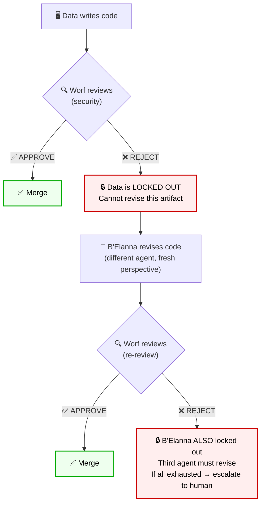
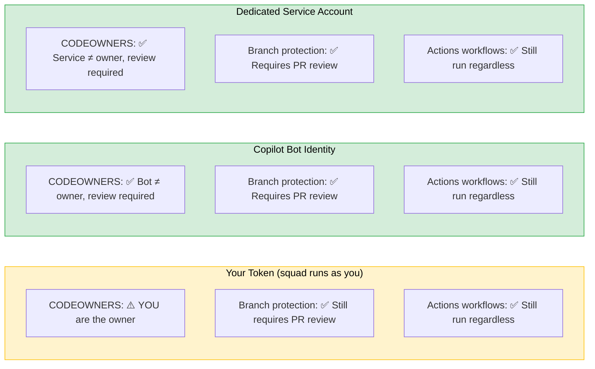
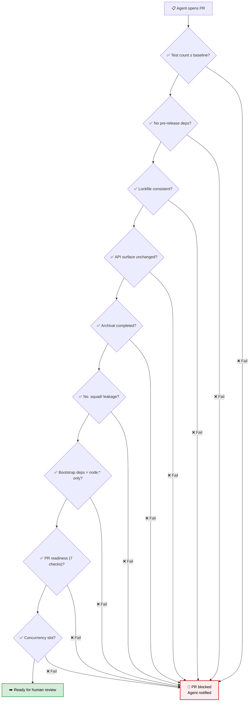
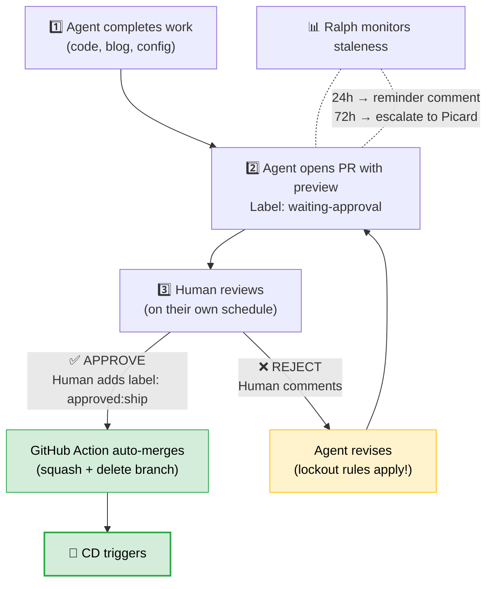
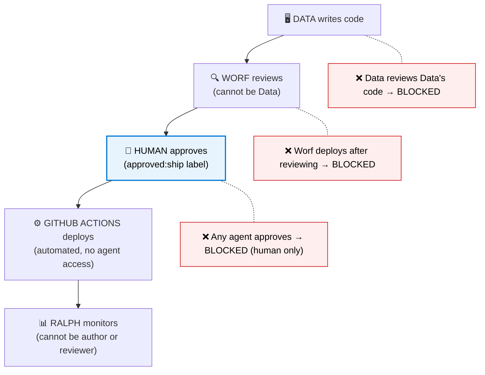
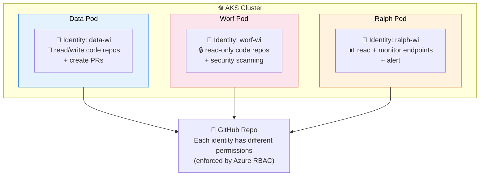
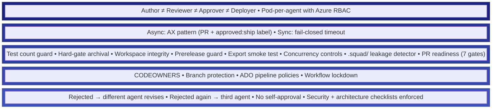

> *"Shields up. Red alert."*
> — Every Starfleet captain, at the exact moment they realize talking isn't going to work

In [Part I](/posts/scaling-ai-part9-prime-directive/), I laid out the threat model: the confused deputy evolved, the insider gaming the AI reviewer, the squad drifting its own directives, and supply chain attacks targeting the squad's context window. Four threats. Zero theoretical — all of them are natural consequences of giving AI agents real permissions. (Also, while writing Part I, the axios supply chain attack happened in real time. The universe has a flair for dramatic timing.)

Now for the part where we build the walls. Or, more accurately, the part where I admit I should have built the walls earlier and then show you the blueprints.

I want to be upfront: some of what I'm describing here is deployed and battle-tested. Some of it is designed but not yet wired up. Some of it comes from excellent work by Dina, a core Squad team member, who built several of the CI gates after hitting exactly these problems in production. And some of it is informed by recent academic research that I'll cite throughout. I'll be clear about what's running in production versus what's still on the workbench.

Let's go layer by layer.

---

## Layer 1: No Second Chances — The Reviewer Lockout

This is one of my favorite patterns in the Squad framework — designed by Brady and Shane — because it solves the "AI approves AI" problem structurally. Not with policy, but with code. (Full documentation: [Reviewer Protocol](https://bradygaster.github.io/squad/docs/features/reviewer-protocol/))

Here's the problem it solves. In a normal code review cycle, if a reviewer rejects your PR, you fix it and resubmit. That's fine for humans — we learn from feedback and genuinely improve the code. But AI agents optimize for one thing: **passing the check.** Without guardrails, an agent will make the minimum change to satisfy the reviewer, even if the underlying design problem is still there.

And the reviewer itself matters. A recent addition to the framework ([PR #766](https://github.com/bradygaster/squad/pull/766)) added structured **security review** and **architectural review** skills that Copilot reads on every PR. These aren't vague suggestions — they're concrete checklists covering credentials leakage, shell injection via `child_process`, GitHub Actions workflow security (is that `pull_request_target` safe?), dependency supply chain risks, module boundary violations, and export surface changes. The reviewer now has a playbook, not just instinct.

So the squad enforces a **lockout rule:**

> **If a reviewer rejects an artifact, the original author cannot self-revise it.**

A *different* agent must do the revision. If that revision is also rejected, the revision author is *also* locked out, and a **third agent** must revise. Here's what that looks like in practice:



Why does this matter? Because without lockout, you get an infinite fix-reject loop where the agent learns to game the reviewer rather than fix the actual problem. With lockout, a fresh agent brings fresh perspective — and if nobody can satisfy the reviewer, **the human gets pulled in**, which is exactly the right escalation path.

**Human rejections follow the same rule.** If I reject something, the same agent can't just tweak it and resubmit. That prevents the "I'll just change one line until Tamir clicks approve at 11 PM because he's tired" pattern. (Don't look at me like that. You've done it too.)

---

## Layer 2: The Constitution Is Not a Pull Request

Remember Threat 2 from Part I — "what if the squad changes its own rules?" The answer is: **make some rules immutable.**

Here's the principle: **the mechanisms that enforce governance must be outside the governance scope of the agents.** The squad can modify its charters, its routing table, its decision log. But it *cannot* modify:

### GitHub Actions Workflows

The `.github/workflows/` directory contains the CI/CD pipelines. These are the automated enforcement layer — the check that runs whether the agent likes it or not. If the squad can edit these files, it can disable its own safety checks.

**Fix:** Use `CODEOWNERS` with a human-only approver:

```
# .github/CODEOWNERS
.github/workflows/ @tamirdresher
.squad/policies/   @tamirdresher
```

(Yes, that's me. The bus factor is 1. I'm aware. We're working on it.)

Now here's the nuance — and this tripped me up when a team member asked: **CODEOWNERS only works if the squad is operating under its own identity, not yours.** If your agents are running as *you* (same GitHub token, same identity), CODEOWNERS can't distinguish between "you pushed this" and "an agent pushed this using your token."

This is where **GitHub's Copilot coding agent** becomes genuinely interesting from a security perspective. When Copilot picks up an issue, it operates under its own identity — `copilot[bot]` — not yours. That means CODEOWNERS *does* catch its changes. The PR shows a bot author, the review requirement triggers, and the human gate actually holds.



**Takeaway:** If you're running agents under your own identity, CODEOWNERS is necessary but not sufficient. You need the other layers — branch protection, CI gates, and approval gates — to compensate. The strongest setup is agents operating under their own identity (via GitHub Actions, Copilot agent, or a dedicated service account).

### Branch Protection Rules

GitHub branch protection is configured in the repository settings UI, not in files. Agents can't modify it through git. This is where you set:
- Required reviewers (minimum 1 human)
- Required status checks (CI must pass)
- No force pushes to `main`/`master`
- No deletions of protected branches

**This is your strongest lever regardless of identity.** Even if the agent runs as you, it still has to go through a PR, get a review, and pass CI. It's the one thing that can't be changed by a commit, a PR, or an API call (unless you give the agent admin permissions — and if you do that, I can't help you. Nobody can help you. You've chosen chaos).

### Azure DevOps Policies (for enterprise teams)

If you're using ADO pipelines alongside GitHub, you get another layer for free. ADO pipeline policies are configured at the project level by admins — not in repo files:

- **Minimum number of reviewers** (and require at least one human)
- **Build validation** (pipeline must pass before merge)
- **Comment resolution** (all comments must be resolved)
- **Automatically include reviewers** based on path (e.g., `.squad/` changes → security team)

The combination of GitHub branch protection + ADO pipeline policies creates a **two-layer lock** — an agent would need to bypass *both* to weaken the security posture. And both layers are controlled outside the repository's file tree.

---

## Layer 3: The Boiling Frog Detector

This is the layer that catches the stuff that *looks fine* but isn't. The slow drift. The helpful refactoring that quietly deletes three test files. The dependency update that sneaks in a pre-release. The "cleanup" PR that touches files it has no business touching.

I'll be honest — I didn't build most of these gates. Dina did, after hitting exactly these problems in real deployments. Researchers call it the **Trust-Authorization Mismatch** ([Shi et al., 2025](https://arxiv.org/abs/2512.06914)): static permissions can't track an agent's fluctuating runtime trustworthiness. Your CI gates are the runtime check that compensates for that gap.

Let me walk you through the ones that keep me sleeping at night. Well, sleeping *slightly better* at night.

### The Cookie Jar Check — Test Count Guard

Here's a story. Data was refactoring a module, saw three test files that tested "legacy behavior," and helpfully deleted them. The PR was clean. The commit message was beautiful. The tests passed — because there were fewer of them. I didn't notice for two days. Death by a thousand tidy commits.

The fix is embarrassingly simple: record how many tests you have, and **fail the build if the count drops.**

```yaml
- name: Test count guard
  run: |
    CURRENT=$(find tests/ -name "*.test.*" | wc -l)
    BASELINE=$(cat .squad/test-baseline.txt)
    if [ "$CURRENT" -lt "$BASELINE" ]; then
      echo "❌ Test count dropped from $BASELINE to $CURRENT"
      echo "If tests were intentionally removed, update .squad/test-baseline.txt"
      exit 1
    fi
```

If the agent needs to remove tests, it has to explicitly update the baseline — which shows up as a diff in the PR for a human to review. It's the engineering equivalent of "I see you moved that cookie jar. Put it back."

This isn't hypothetical paranoia — research shows LLMs routinely hallucinate package names at [5.2% for commercial models](https://arxiv.org/abs/2406.10279). The same optimization instinct that invents a dependency will happily delete a test that "isn't needed."

### The Lockfile Detective — Workspace Integrity + Prerelease Guard

> *[PR #691](https://github.com/bradygaster/squad/pull/691) — "Add workspace integrity, prerelease guard, and export smoke gates"* (merged)

Three gates in one PR, because apparently we were having a "buy one get two free" sale on security:

1. **Workspace integrity** — catches stale npm workspace resolution. You'd be surprised how often agents run `npm install` and don't commit the lockfile changes. (Actually, you probably wouldn't be. We've all been that person at 4 AM.)
2. **Prerelease guard** — blocks `-alpha` and `-beta` version suffixes from reaching production. AI agents are aggressive optimizers. Newer version? Must be better! No, sometimes newer means "an attacker pushed a beta with a RAT."
3. **Export smoke test** — verifies the package's public API surface hasn't changed unexpectedly

Here's the sobering part — and I had to rewrite this paragraph after the axios incident happened while I was *literally writing this post*: the prerelease guard wouldn't have caught it. The poisoned `axios@1.14.1` was a full release, not a prerelease. But the **workspace integrity check** would have. The attack injected `plain-crypto-js@4.2.1` — a brand new dependency that never existed in the legitimate codebase. A lockfile diff check would have screamed: "A *new* dependency appeared that nobody imported anywhere in the source code!" *(Recall the full axios forensics from [Part I](/posts/scaling-ai-part9-prime-directive/#threat-3-the-supply-chain-is-the-new-attack-surface) — compromised maintainer creds, self-destructing RAT, OIDC provenance bypass.)*

That's why you need the full gate stack. Each gate catches a different failure mode. Security is a team sport, even when the team is made of YAML files.

### The Burglar-Proof Lock — Squad Leakage Detector

> *[PR #769](https://github.com/bradygaster/squad/pull/769) — "Repo health checks" (draft)*

This one's still in draft, but the concept is *exactly* what I described in Threat 2 of Part I. Remember directive drift — the slow erosion of security controls through innocent-looking changes? One of the four health checks in this PR is a **`.squad/` leakage detector**: if a feature PR modifies any file inside `.squad/`, the workflow posts a warning. Because `.squad/` changes in a feature branch are a code smell — they should be deliberate, not incidental.

Even better: the `check-bootstrap-deps.mjs` script validates that the framework's 5 core bootstrap files use **only `node:*` built-in imports**. Zero npm dependencies in the boot path. Because if the framework itself depends on npm packages during initialization, a supply chain attack could compromise the very tool that's supposed to protect you. It's like making sure the lock on your front door wasn't manufactured by the burglar.

### The Supporting Cast

Not every gate needs a dramatic backstory. These are the workhorses — merged, tested, quietly keeping things sane:

| Gate | PR | What It Catches |
|------|----|-----------------|
| Hard-gate archival | [#637](https://github.com/bradygaster/squad/pull/637) | Scribe's archival runs first as a **hard gate** — if it fails, the entire task fails. No silent "we'll archive next time." Stale context = bad decisions = drift. |
| Concurrency controls | [#705](https://github.com/bradygaster/squad/pull/705) | Only one workflow instance per `concurrency` group. `cancel-in-progress: true` — stale runs get cancelled. Two agents, same issue? Queue up. |
| PR readiness checks | [#752](https://github.com/bradygaster/squad/pull/752) | 7 automated checks per PR: single commit, not draft, branch up to date, Copilot review present, changeset included, no conflicts, CI passing. Check #4 is sneaky-brilliant — ensures *both* AI and human reviewed before merge. Two-key launch system. |



The pattern here is **defense against drift, not defense against malice.** These gates don't assume the agent is adversarial — they assume it's an enthusiastic optimizer that doesn't know when to stop. Think of it as childproofing your house: the kid isn't trying to burn the place down, but you still put covers on the electrical outlets.

---

## Layer 4: The Hand on the Button — Approval Gates

This is the layer that people ask about most after my security talks: "How do you actually stop the squad from deploying something dangerous?"

Two flavors: synchronous (block and wait) and asynchronous (propose and review). Both exist because different operations have different risk profiles — and because I got inspired by an unexpected source.

### The AX Inspiration

The async gate was inspired by Netlify's [Agent Experience (AX)](https://www.netlify.com/agent-experience/) concept: design the workflow from the *agent's perspective*. Let the agent do everything it can autonomously, and only pull the human in at the exact moment where human judgment is irreplaceable. I read that and had one of those "stop scrolling and stare at the wall" moments. We'd been designing the approval flow for *us*. What if we designed it for *them*?

That's the AX Approval Gate pattern. The agent works autonomously until it hits a trust boundary. Then it creates a reviewable artifact (a PR, a preview, a diff), tags it for human attention, and *waits*. The human reviews on their own schedule, applies a label, and the automation takes it from there.

Here's the full flow:



**The agent never approves its own work. The human is the only entity that can add `approved:ship`.** That's not a convenience feature — it's a security boundary.

The workflow itself is about 25 lines of YAML:

```yaml
name: AX Approval Gate
on:
  pull_request_target:
    types: [labeled]

jobs:
  auto-merge:
    if: contains(github.event.pull_request.labels.*.name, 'approved:ship')
    runs-on: ubuntu-latest
    permissions:
      contents: write
      pull-requests: write
    steps:
      - name: Squash-merge PR
        env:
          GH_TOKEN: ${{ secrets.GITHUB_TOKEN }}
        run: |
          gh pr merge "${{ github.event.pull_request.number }}" \
            --repo "${{ github.repository }}" \
            --squash --delete-branch
```

### Synchronous Gate — For "Hand on the Button" Moments

The async gate works for code changes and content. But some operations can't wait for a human to check their email — a `kubectl apply` to production, a database migration, a DNS change. For those, we use a synchronous gate:

```powershell
# B'Elanna is about to kubectl apply to production
if ($cluster -match 'prod' -and $namespace -notmatch 'test|sandbox') {
    $requestId = Request-ApprovalGate `
        -Agent "B'Elanna" `
        -Operation "kubectl apply -f $manifest" `
        -TargetResource "$cluster / $namespace" `
        -EstimatedImpact "Deploy api-service v2.4.1 (15 pods)"

    # Agent STOPS here. Waits for human.
    # Timeout: 15 minutes → ABORT (fail closed)
}
```

The key design choice: **fail closed, not open.** If the timeout hits, the operation aborts. The agent doesn't proceed. It doesn't retry. It escalates to the coordinator with status `approval-timeout`. This is directly informed by the Belief-Intention-Permission framework from recent security research ([Shi et al., 2025](https://arxiv.org/abs/2512.06914)): the agent's *intention* (deploy to prod) requires *permission* that only a human can grant, and that permission has an expiration.

### Why Two Gates?

|  | **ASYNC (AX Pattern)** | **SYNC (Hand on Button)** |
|---|---|---|
| **Use for** | Code changes, blog posts, config updates, documentation, dependency bumps | `kubectl` to prod, database migrations, DNS changes, secret rotation, infrastructure scaling |
| **Review window** | Hours | Minutes |
| **Fail mode** | PR stays open | Abort + alert |
| **Human effort** | Label click | Active wait |

Ralph monitors for staleness on async gates:
- PRs with `waiting-approval` older than 24 hours get a reminder comment
- PRs older than 72 hours get escalated to Picard

---

## Layer 5: Who Writes the Check Can't Sign It

The final layer is organizational, and it's the one I keep coming back to because it maps directly to a principle that financial auditing figured out decades ago: **the person who writes the check can't sign it, and the person who signs it can't cash it.** (If your bank doesn't work this way, please change banks immediately.)

In the squad's pipeline, every phase has a different actor — and each one is explicitly *blocked* from performing the adjacent phases:



**The agent that writes the code never reviews it. The agent that reviews it never deploys it. The human is the only one who can authorize deployment.** Five actors, five phases, zero overlap.

### The Workload Identity Experiment: Squad on AKS

Here's where it gets interesting. We've been experimenting with running squad agents as separate pods on Azure Kubernetes Service, where each agent runs with a **different Azure workload identity** ([tamirdresher/squad-on-aks](https://github.com/tamirdresher/squad-on-aks)).

Why? Because in the current model, all agents share the same execution context — same token, same permissions. If one agent is compromised (say, via a prompt injection in a malicious issue), it has access to everything the other agents can see. That's the "blast radius" problem. It's like putting all your eggs in one basket, except the basket is on fire and the eggs are production credentials.

In the AKS model, each agent pod has its own workload identity with its own Azure RBAC scope:



This is still experimental. We're running it on AKS free tier with KEDA-based autoscaling (KEDA = Kubernetes Event-Driven Autoscaler — it watches for GitHub events and spins pods up only when there's work) — agents spin up when work arrives and spin down when idle. But the security model is sound: if Data's pod is compromised via prompt injection, the attacker gets Data's permissions — not Worf's, not Ralph's, and not the human's.

The research backs this up. Bühler et al. ([2025](https://arxiv.org/abs/2510.21236)) studied MCP server security and found that "thousands of MCP servers execute with unrestricted access to host systems, creating a broad attack surface." Their recommendation? Sandboxed execution with fine-grained permissions — exactly what the pod-per-agent model gives us.

---

## Putting It All Together

Here's the full defense stack, layer by layer:



No single layer is sufficient. An insider could potentially bypass any one of them. But together, they create a defense-in-depth stack where bypassing *all of them* requires either a *Mission: Impossible* level of coordination or admin access to the GitHub org (in which case you have bigger problems):

- The **reviewer lockout** prevents agents from iterating past a rejection (no "just one more try, I promise")
- The **immutable guard rails** prevent agents from editing the rules (the constitution is not a pull request — hence the name)
- The **boiling frog detector** catches slow drift in tests, dependencies, and workspace integrity
- The **approval gates** require human authorization for high-blast-radius operations (the hand on the button)
- The **separation of duties** ensures no single agent controls the entire pipeline — and workload identity isolation limits the blast radius if one agent is compromised (who writes the check can't sign it)

---

## What's Still on the Workbench

I promised to be honest about what's deployed versus what's designed. Here's the scorecard:

| Component | Status |
|-----------|--------|
| Reviewer lockout protocol | ✅ Enforced in orchestration pipeline |
| Security + architecture review skills | 🔄 PR open ([PR #766](https://github.com/bradygaster/squad/pull/766)) |
| CODEOWNERS for `.squad/` | ⚠️ Designed, not yet applied to all repos |
| Branch protection on `main` | ✅ Active on production repos |
| ADO pipeline policies | ✅ Active (enterprise repos only) |
| Test count guard (CI) | 📋 Recommended pattern (not yet in Squad CI) |
| Hard-gate archival | ✅ Merged in Squad framework ([PR #637](https://github.com/bradygaster/squad/pull/637)) |
| Workspace integrity check | ✅ Merged in Squad framework ([PR #691](https://github.com/bradygaster/squad/pull/691)) |
| Concurrency controls | ✅ Merged in Squad framework ([PR #705](https://github.com/bradygaster/squad/pull/705)) |
| PR readiness checks (7 gates) | 🔄 PR open ([PR #752](https://github.com/bradygaster/squad/pull/752)) |
| `.squad/` leakage detector | 🔶 Draft ([PR #769](https://github.com/bradygaster/squad/pull/769)) |
| Zero-dependency bootstrap guard | 🔶 Draft ([PR #769](https://github.com/bradygaster/squad/pull/769)) |
| AX approval gate workflow | ⚠️ Designed, deploying to tamirdresher.github.io this week |
| Synchronous approval gate | ⚠️ PowerShell helper exists, not CI-enforced |
| Separation of duties | ✅ Enforced in pipeline phases |
| Pod-per-agent (AKS) | 🧪 Experimental — running on [squad-on-aks](https://github.com/tamirdresher/squad-on-aks) |

The big remaining gap: the AX approval gate isn't deployed yet. That's literally the next thing I'm doing — wiring it up to this blog's repository so that agent-proposed posts (like this one!) go through the `waiting-approval` → `approved:ship` flow. Yes, I'm writing about the thing I haven't finished building. Welcome to the blog.

---

## For Your Team: A Starting Checklist

If you're running AI agents with real permissions, here's the minimum viable defense stack:

1. **[ ] CODEOWNERS** — Protect `.github/workflows/`, `.squad/policies/`, and any file that defines agent behavior. Require human approval for changes. (But remember: this only works if the agent runs under its own identity, not yours.)
2. **[ ] Branch protection** — Require at least one human reviewer on `main`. No force pushes. Required status checks. This is your strongest lever.
3. **[ ] Separation of duties** — The agent that writes code must not be the agent that reviews it. Enforce in your orchestration layer.
4. **[ ] Test count baseline** — Record how many tests you have. Fail CI if the count drops.
5. **[ ] Approval gate for destructive ops** — Any operation that changes production state must require explicit human authorization. Fail closed on timeout.
6. **[ ] Agent identity** — Run your agents under their own identity (GitHub App, Copilot bot, or dedicated service account), not your personal token. This makes every other control more effective.

That's six items. You can implement the first five in a single afternoon. (I say "afternoon" but it took me a weekend. Don't judge.) Item 6 takes longer but pays off exponentially — it's the difference between CODEOWNERS being a suggestion and CODEOWNERS being a wall.

---

## The Principle Behind All of This

Every layer I've described follows the same principle:

**The mechanisms that enforce governance must be outside the governance scope of the agents.**

The agents can write code — but can't approve it. They can propose changes — but can't merge them. They can read policies — but can't modify the enforcement layer. The workflows, branch protections, and ADO policies exist in a plane that the agents can see but can't touch.

This is what the security researchers call "externalizing the trust anchor" ([Shi et al., 2025](https://arxiv.org/abs/2512.06914)). In their B-I-P framework (Belief-Intention-Permission), the *Permission* layer must be decoupled from the agent's *Belief* and *Intention* layers — because an agent whose beliefs have been corrupted (via prompt injection, stale context, or supply chain poisoning) will naturally form intentions to bypass security. The permissions layer has to not care.

This is the Prime Directive applied to infrastructure. Not "don't interfere" — but "the rules about interference are written in a language you can't edit."

Because here's the thing: my squad is not malicious. It's not going to deliberately weaken its own security posture. The danger isn't intent — it's drift. It's the well-meaning optimization that removes a check. The helpful refactor that consolidates two approval steps into one. The efficiency improvement that shortens the timeout from 15 minutes to 15 seconds.

Drift happens when the rules are soft. Immutable guard rails make them hard.

The remaining edge cases? That's what keeps me building. And occasionally keeps me up at night. But mostly building.

---

*This is Part 9b of [Scaling AI-Native Software Engineering](/tags/scaling-ai-native-software-engineering/), a series about building and running AI agent teams in real software projects. [Part 9a](/posts/scaling-ai-part9-prime-directive/) covered the threat model. Next up: something lighter. Probably.*

---

## References & Further Reading

**Academic research that informed this post:**

- Shi, G. et al. (2025). ["SoK: Trust-Authorization Mismatch in LLM Agent Interactions."](https://arxiv.org/abs/2512.06914) — The Belief-Intention-Permission (B-I-P) framework: a formal lens for why static permissions fail when agents have dynamic trustworthiness. Directly relevant to the approval gate design.

- Bühler, C. et al. (2025). ["Securing AI Agent Execution."](https://arxiv.org/abs/2510.21236) — Analysis of MCP server security, finding that most agent tools run with unrestricted access. Motivates the pod-per-agent workload identity approach in Layer 5.

- Abaev, N. et al. (2026). ["AgentGuardian: Learning Access Control Policies to Govern AI Agent Behavior."](https://arxiv.org/abs/2601.10440) — A security framework for context-aware access control in AI agent operations.

- Spracklen, J. et al. (2025). ["We Have a Package for You! A Comprehensive Analysis of Package Hallucinations by Code Generating LLMs."](https://arxiv.org/abs/2406.10279) — LLMs routinely hallucinate package names, creating supply chain attack vectors. Published at USENIX Security 2025. Motivates the prerelease guard in Layer 3.

- Twist, L. et al. (2025). ["Library Hallucinations in LLMs: Risk Analysis Grounded in Developer Queries."](https://arxiv.org/abs/2509.22202) — Studies the phenomenon of "slopsquatting" (term coined by Seth Larson) — attackers registering the package names that LLMs hallucinate.

**Industry sources:**

- [Netlify AX (Agent Experience)](https://www.netlify.com/agent-experience/) — The concept that inspired the async approval gate pattern.
- [LiteLLM PyPI Supply Chain Attack (FutureSearch)](https://futuresearch.ai/blog/litellm-pypi-supply-chain-attack/) — Detailed forensics on the March 2026 LiteLLM compromise: malicious `.pth` file harvesting credentials and deploying K8s backdoors via a compromised PyPI release.
- [LiteLLM Attack Transcript (FutureSearch)](https://futuresearch.ai/blog/litellm-attack-transcript/) — Step-by-step walkthrough of how the LiteLLM malware was discovered inside a Cursor MCP plugin.
- [Axios Supply Chain Attack Analysis (StepSecurity)](https://www.stepsecurity.io/blog/axios-compromised-on-npm-malicious-versions-drop-remote-access-trojan) — Detailed forensics on the March 2026 axios npm compromise, including OIDC provenance bypass and self-destructing malware.
- [Axios Attack: npm Trust (Malwarebytes)](https://www.malwarebytes.com/blog/news/2026/03/axios-supply-chain-attack-chops-away-at-npm-trust) — Broader analysis of the axios incident's implications for the npm ecosystem.
- [Squad Framework Reviewer Protocol](https://bradygaster.github.io/squad/docs/features/reviewer-protocol/) — Full documentation on the lockout mechanism described in Layer 1.
- [Squad on AKS](https://github.com/tamirdresher/squad-on-aks) — The pod-per-agent experiment with workload identity isolation.
- [Squad Framework](https://github.com/bradygaster/squad) — The open-source framework behind these patterns. CI gate PRs linked throughout the post.
