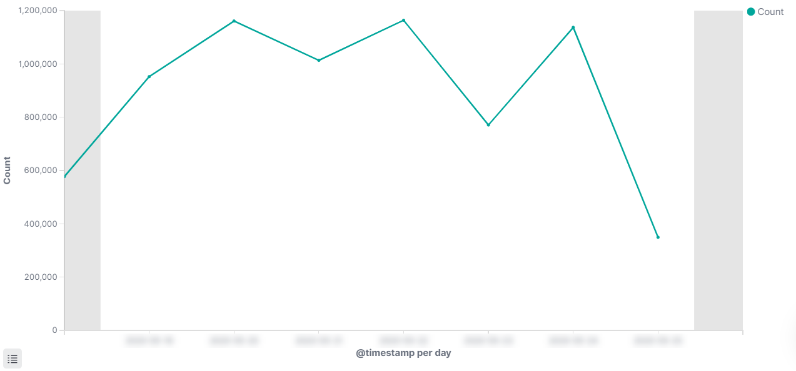
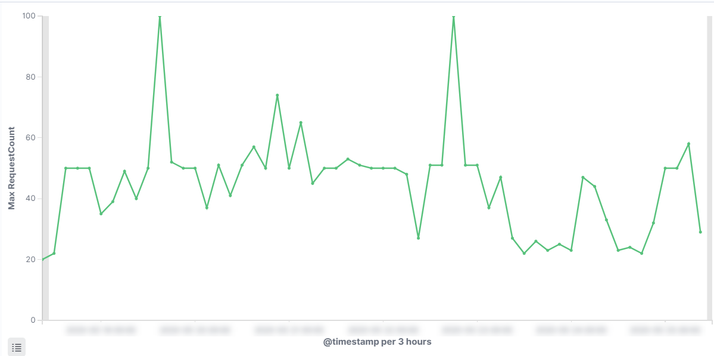

A few months ago we announcend that we will start imposing rate-limit on the Clarizen One API (read more here https://success.clarizen.com/hc/en-us/articles/360012223839-API-Updates-for-Developers), this created some noise at our customers and some of them requested guidenace on how they should change their custom applicaitons to handle the new policy.

## Intro - What is API rate-limit and why Clarizen added it?
Clarizen API is heavliy used by our customers, many of them built custom applications and custom integrations that use Clarizen advanced API [query language](https://api.clarizen.com/V2.0/services/data/Query) and backend calculations to implemnt complex scenarios to automate their business workflows.


Our API is scalalbe and performs well, but even with the best hardware and software, without setting limits, customers can step on their of toes and create a load that will affect the perofrmance and user experience of their tenatn and soemtimes even on other tenants
1. Exhusting thread-pools
2. Creating bottelencks in DB connection pools
3. Increasing the risk for locks and even deadlocks in the DB or other types of resources

Over time we discovered that some clients can create heavy load on the API (at some point we even saw thousands of calls per second coming from single client!)


So one good to fix these issues is to avoid them form the first place, hence rate-limit was created.

## How the rate-limit works?
Clarizen looks at users from two angles, as an individual doing operations in the applications, as a member of a tenant (organization) performing operation on behalf of the organization he belongs to.

Most of the cases that involve the API usage are coming from organization level of operation - for example, suncying the currency rates from your financial system with Clarizen. 

So simply put, the way our rate-limit works is that we count the amount of API calls made in a sliding window of 1 second from any user of your organiztion. 
This however has some exclusions:
1. Any API call coming from the UI
2. Any API call coming from Clarizn internal tools and integration platform 

### What happens when my API call hit the limit
If your API client does more request than allowed in a single second, you will get a response with HTTP status code 429 (Too many requests)

Here is an exmpale of a response i got
```
HTTP/1.1 429 Too Many Requests
Cache-Control: no-cache, no-store
Pragma: no-cache
Content-Type: application/json; charset=utf-8
Expires: -1
Retry-After: 1
Server: Microsoft-IIS/10.0
X-CORRELATION-ID: 99gb8IZc00mig+T36qz08w
X-ORIGIN-ID: API
X-LASTORIGINUTCTIME-ID: 5/25/2020 7:51:33 AM
X-PROF-TIME: 67.11
X-AspNet-Version: 4.0.30319
X-Powered-By: ASP.NET
Content-Length: 121
Date: Mon, 25 May 2020 07:52:16 GMT
Connection: keep-alive

{"statusCode":"Too Many Requests","message":"API calls quota exceeded! maximum admitted 25 per Second.","retryAfter":"1"}
```

What you should understand from this is that API client code you write should now be aware to such faults and should protect itself.

## How to protect from _429 Too Many Requests_
First thing you need to understand is that there are no magic here, you have to design your API clients so they won't flood the API. This is generally true to any API you consume, any specifically to Clarizen API.

One of the most popular techniques to remedy the rate-limit response is just adding some kind of retry mechnism with beckoffs (delays) between the attempts. The delay can be fixed so the same amount of time is waited every time, or it can be with some randomization (known as [exponantial backoff](https://en.wikipedia.org/wiki/Exponential_backoff))

The followin example show a C# program that calls the Clarizen API and simply run in a loop until teh call succeed with some delay between each iteartion. If the maximum amount of retries is reached, we just throw an exception (remember, there is not silverbullet)



Another option is to use a library that does this retrun logic for you. In the .NET ecosystem, [Polly](https://github.com/App-vNext/Polly) is a very powerful and popular option:



Last, it worth mentioning the popular [Ekin.Clarizen](https://github.com/ekincaglar/clarizen) library that provide a .NET Wrapper for Clarizen API v2.0. If you are using Ekin.Clarizen then you would 



## Final words
API rate-limit is a widely used and stanadard way to protect APIs from being flooded.
I understand that it makes the client code more complex and that requires more work to protect you code from the new reality, but at the same time I'm sure and hope that you now understand as well, that in the end this was made to give the best user experience possible for Clarizen users. 
With a simple change to your code and a bit of planning, you can easily tweak your code to make sure you won't see any failures in your applications.